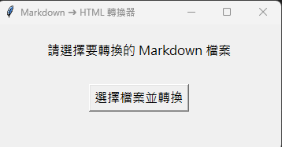

# Markdown ➜ HTML 離線轉換器

一款堪用，可將Markdown文件轉換為HTML的Python工具，主要將Markdown文件中插入的圖片轉換為base64編碼，傳輸時就不需要將圖片一起打包。

* 優點
  * 傳輸HTML無須其他套件，可透過各式瀏覽器顯示Markdown格式文件，且不需要夾帶圖片檔

* 缺點
  * 輸出的HTML檔案容量會變大(增加1.33倍左右)
  * 無法編輯圖片及難以編輯內文

---

HTML輸出格式風格參照：[md-reader](https://github.com/md-reader/md-reader)
輸出風格只有暗色系，切換亮色系的功能下次一定。

## 安裝與環境需求

- Python 3.8 以上版本

安裝相依套件：

```bash
pip install -r requirements.txt
```
## 使用說明

安裝相關套件後，可透過CLI或GUI介面轉換MarkDown檔案
1. CLI
   cd 到mdToHtml.py的目錄下，執行
   ```cmd
   python mdToHtml.py "your_md_file_path"
   ```
2. GUI
   執行
   ```cmd
   python mdToHtml.py
   ```
   跳出GUI頁面點選「選擇檔案並轉換」，選擇要轉換的md檔後，會將HTML輸出在與md檔相同目錄下
   
